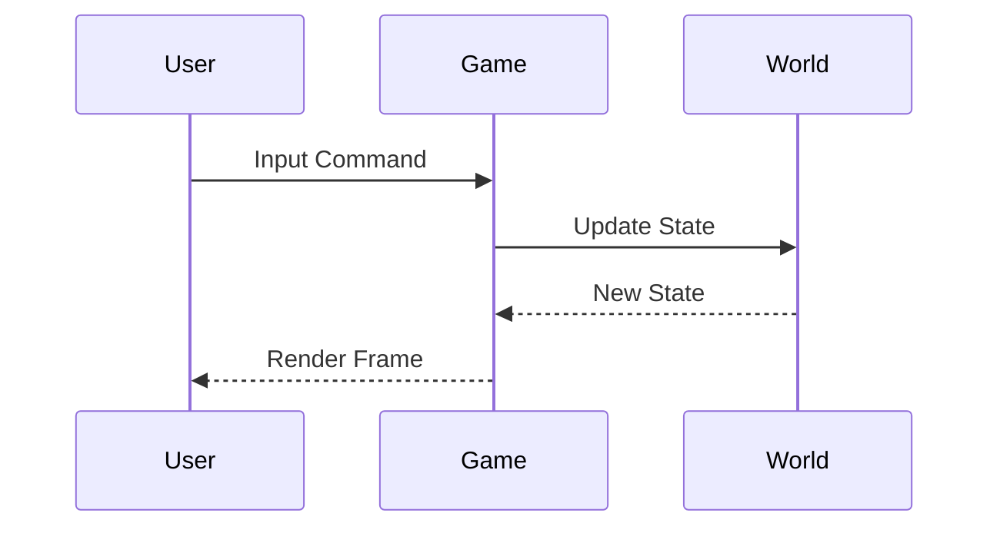

# Documentation Standards

## 1. Document Structure

### 1.1 File Naming
- Use `kebab-case` for all filenames
- End markdown files with `.md`
- Use descriptive, concise names (e.g., `character-ai.md` not `ai_for_characters.md`)

### 1.2 Document Headers
```markdown
# Document Title

## Overview
Brief description of the document's purpose and scope.

## Table of Contents
- [Section 1](#section-1)
- [Section 2](#section-2)
```

## 2. Writing Style

### 2.1 General Guidelines
- Use present tense
- Be concise but thorough
- Use active voice
- Keep paragraphs short (3-5 sentences max)
- Use bullet points for lists of items
- Use numbered lists for sequences or steps

### 2.2 Technical Terms
- **Bold** for key terms on first use
- `Code font` for:
  - Code elements
  - File paths
  - Commands
  - Technical parameters

## 3. Code Examples

### 3.1 Formatting
- Use code blocks with language specification
- Keep examples focused and minimal
- Include comments for clarity

```typescript
// Good: Clear, commented example
interface Character {
  id: string;      // Unique identifier
  name: string;     // Display name
  health: number;   // Current health points
}
```

### 3.2 Pseudo-code
- Use when language-agnostic examples are needed
- Clearly mark as pseudo-code
- Maintain consistent syntax

## 4. Version Control

### 4.1 Changelog
- Keep a `CHANGELOG.md` in the root directory
- Follow [Keep a Changelog](https://keepachangelog.com/) format
- Include date, version, and change type (Added, Changed, Fixed, Removed)

### 4.2 Commit Messages
- Use conventional commits:
  - `feat:` for new features
  - `fix:` for bug fixes
  - `docs:` for documentation changes
  - `refactor:` for code refactoring
  - `test:` for test updates
- Keep first line under 50 characters
- Include details in the body if needed

## 5. Document Types

### 5.1 Design Docs
- Start with problem statement
- Include proposed solution
- List alternatives considered
- Include diagrams where helpful

### 5.2 API Documentation
- Use OpenAPI/Swagger format for REST APIs
- Include:
  - Endpoint description
  - Parameters
  - Request/response examples
  - Error codes

## 6. Diagrams

### 6.1 Types
- Use Mermaid.js for diagrams in markdown
- Include alt text for accessibility
- Keep diagrams simple and focused

### 6.2 Example
````markdown

````

## 7. Review Process

### 7.1 Peer Review
- All documentation should be peer-reviewed
- Use PR templates for consistency
- Address all review comments before merging

### 7.2 Updating Documentation
- Keep documentation in sync with code
- Update documentation when features change
- Remove outdated information

## 8. Style Guide

### 8.1 Markdown Linting
- Use [markdownlint](https://github.com/DavidAnson/markdownlint)
- Maximum line length: 100 characters
- Use ATX-style headers (## not Underlined headers)

### 8.2 Language and Grammar
- Use US English spelling
- Avoid jargon and acronyms without definition
- Use gender-neutral language

## 9. Related Documents
- [Character System](../character/README.md)
- [World System](../world/README.md)
- [Game Loop](../game_loop/README.md)
- [Technical Architecture](../architecture/README.md)
